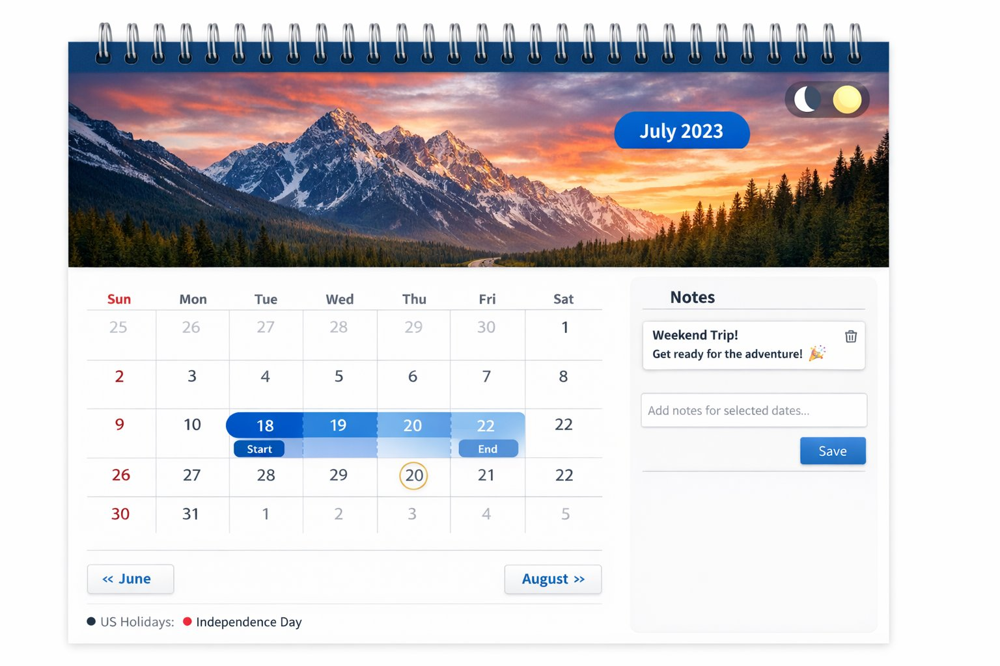

Here is your **clean, professional, no-emoji README** with proper navigation and your real links added.

You can replace your entire `README.md` with this:

---

# Interactive Wall Calendar

A fully interactive, wall-style calendar component built with React.
Submitted as part of the Frontend SWE Intern Task for TakeUforward.

---

## Live Demo

Application:
[https://interactive-wall-calendar-one.vercel.app/](https://interactive-wall-calendar-one.vercel.app/)

Repository:
[https://github.com/Masthan-Basha/interactive-wall-calendar](https://github.com/Masthan-Basha/interactive-wall-calendar)

---

## Features

### Core Requirements

| Feature                 | Details                                                                        |
| ----------------------- | ------------------------------------------------------------------------------ |
| Wall calendar aesthetic | Spiral binding, full-width hero image per month, blue month/year overlay badge |
| Date range selection    | Click to set start → hover to preview → click to set end                       |
| Visual range states     | Distinct styling for start, end, in-range, and hover preview                   |
| Integrated notes        | Notes tied to selected date range with editable textarea                       |
| Saved notes panel       | Lists all notes, supports reload and delete                                    |
| Responsive layout       | Stacks vertically on smaller screens                                           |

### Additional Enhancements

* Dark and Light mode toggle
* Holiday indicators with hover tooltip
* Today highlight with border ring
* Smooth month transition animation
* localStorage persistence for notes

---

## Tech Stack

* React 18 (Functional Components + Hooks)
* Vite
* Pure CSS (No external UI libraries)
* localStorage for persistence

---

## Project Structure

```
interactive-wall-calendar/
├── public/
│   └── preview.png
├── src/
│   ├── components/
│   │   └── InteractiveCalendar.jsx
│   ├── App.jsx
│   ├── main.jsx
│   └── index.css
├── index.html
├── vite.config.js
├── package.json
├── .gitignore
└── README.md
```

---

## Getting Started

### Prerequisites

* Node.js v18+
* npm

### Installation

```bash
git clone https://github.com/Masthan-Basha/interactive-wall-calendar.git
cd interactive-wall-calendar
npm install
npm run dev
```

Open:

[http://localhost:5173](http://localhost:5173)

### Production Build

```bash
npm run build
npm run preview
```

---

## Design Decisions

| Decision                   | Reason                                                 |
| -------------------------- | ------------------------------------------------------ |
| Inline styling             | Makes the component portable and easy to integrate     |
| Separate hover state       | Enables live preview without mutating final selection  |
| useCallback for navigation | Prevents unnecessary re-renders                        |
| localStorage persistence   | Maintains notes across refresh                         |
| Date.now() IDs             | Simple unique ID generation without extra dependencies |

---

## Preview



---

## Deployment

Deployed using Vercel.
Vite framework preset was auto-detected during deployment.

---

## Author

Masthan Basha
Frontend SWE Intern Applicant
GitHub: [https://github.com/Masthan-Basha](https://github.com/Masthan-Basha)

---

## License

MIT

---
